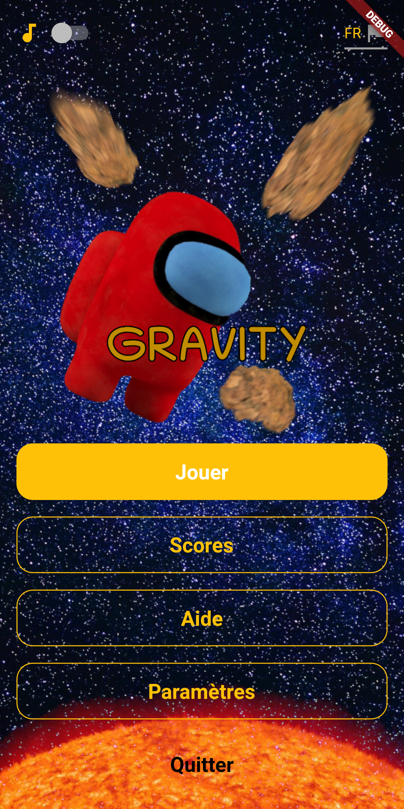
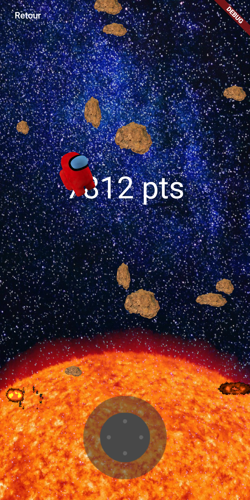

# GRAVITY

Hello, this is my first flutter app using Flame 2D engine ! The project was carried out with the aim to learn the flutter basics.

##  Features covered
- splashscreen
- game engine (lib :flame, vector_math)
- game controller (custom class)
- sharedpref (lib: shared_preferences, feature: score)
- audio (lib: audioplayers & flame)
- navigation
- future methods
- score list
- contact form with http request (lib: http)
- portfolio webview (lib: webview_flutter)
- switch button as reusable widget
- select as reusable widget
- custom dialog
- app icon (terminal cmd)
- empty score list placeholder
- internationalisation (lib: i18n)
- score model object
- json encode/decode
- globalKey (refresh on back) 
- share data between screen
- global variables 

## Envie de tester ?
Télécharger l'[APK](/apk/gravity.apk)